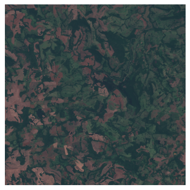
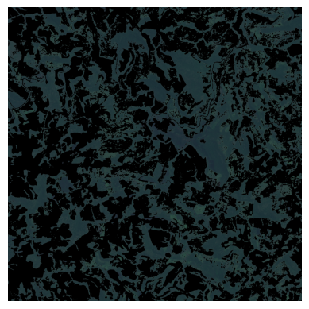
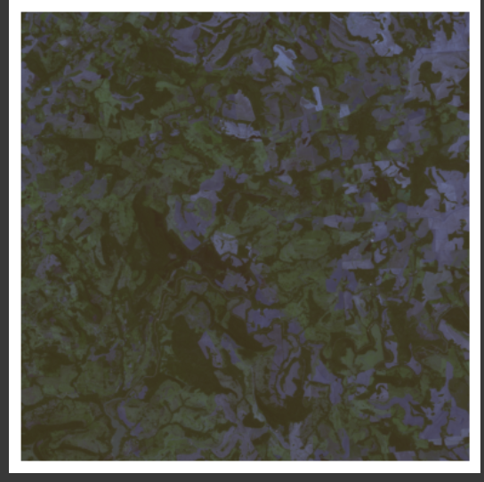

# Atividade: Relatório sobre Tarefas de Processamento de Imagem

## Correção de Cor:

A correção de cor possui como objetivo destacar, remover, augmentar ou trocar determinads cores de uma imagem em outra.

Suas aplicações são diversas, uma simples sendo transformar uma imagem colorida em preto e branco, para passar uma ambientação de uma foto antiga, por exemplo. Outra opção é adaptar um cenário para pessoas daltônicas, adicionando acessibilidade a um determinado produto.

A correção de cor no mercado pode ser utilizada principalmente para marketing e edição de vídeo. Sobre marketing, o aumento da saturação de determinada imagem pode deixa-lo mais vivo, como no anúncio de um lanche, por exemplo. Em edição de vídeo, alguns filmes utilizam filtros para causar uma certa ambientação, como em filmes com teor melancólico costumam ter um filtro de azul, cor fria que costuma representar este sentimento.

Exemplo teste:

Aqui eu selecionei uma imagem de satélite fornecida pelo parceiro de projeto, e criei um código básico no Colab que transforma qualquer área com mínimo de teor de vermelho em preto, destacando as florestas e grandes vegetações naturais de determinada área.

Os resultados mostram que boa parte da área é composta por mata, e mostra que não há padrões uniformes de distribuição. Com a flora possuindo enormes ruídos entre vegetação extensões, pode-se concluir que boa parte da mata neste local continua intacta, com a maioria das intevenções humanas sendo possíveis nas áreas excluídas (vermelhas).

## Orientação:

Na orientação, uma manipulação mais severa é realizada na imagem. Estas manipulações consistem em virar, distorcer ou cortar certas partes da imagem.

Na industria, esta manipulação pode ser utilizada para criar simetrias entre imagens em aplicativos como Photoshop, por exemplo. Esta ferramenta é útil para equipes de marketing, e ajuda na criação e mais fácil manipulação de objetos como espelhos, algo que não precisa ser aplicado somente a imagem, mas também a vídeos ou jogos.

Neste exemplo, eu selecionei a imagem citada anteriormente e virei ela horizontalmente e verticalmente. Infelizmente, não se pode concluir nada sobre esta manipulação, pois ela é mais eficaz em objetos que possuem algum padrão, como a foto de uma pessoa, por exmeplo, algo que como dito anteriormente, não se encontra em tal imagem. (Não sei porque o Colab distorceu as cores)